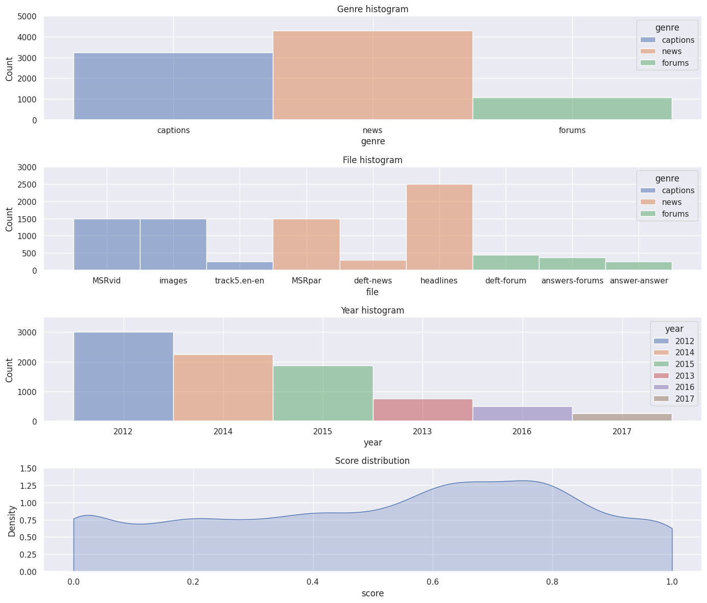
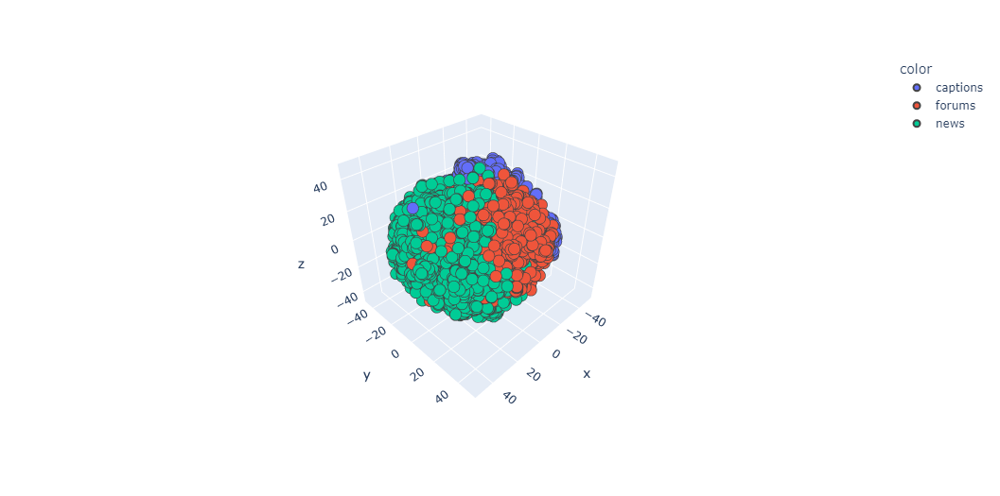
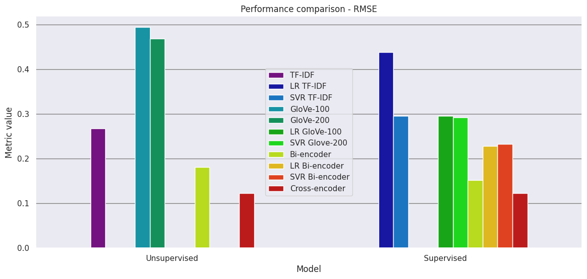
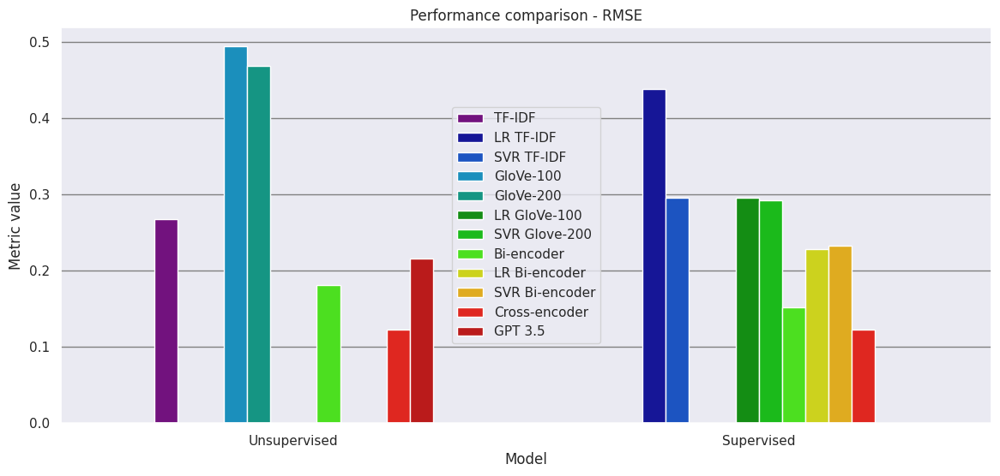
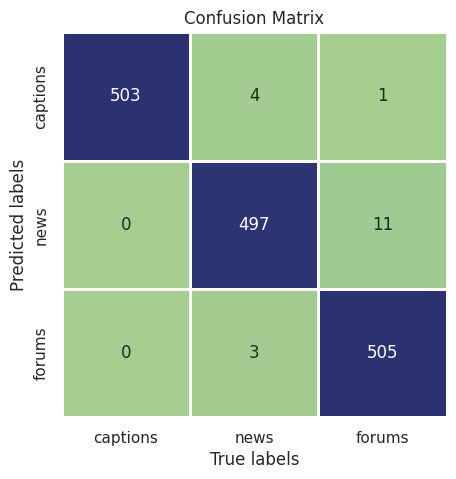

# STS: Semantic Textual Similarity


## Description
Project developed as part of the course _Natural Language Processing_ at Politecnico di Milano during the academic year 2022–2023. It consists of a text similarity analysis using the [Semantic Textual Similarity (STS) dataset](http://ixa2.si.ehu.eus/stswiki/index.php/STSbenchmark).

The dataset consists of pairs of sentences that humans have judged on how similar they are to one another, based on their semantic agreement. The sentences have been sourced from three domains (news, caption and forum). The goal is to predict the similarity between the sentences.

All the analysis and results are presented in the Jupyter Notebook [Semantic Textual Similarity.ipynb](Semantic%20Textual%20Similarity.ipynb), which is divided into three main sections:
- **Preliminary Analysis:** exploratory data analysis, visualization, clustering and topic modeling
- **Models:** implementation of different models to predict the similarity between the sentences. Both supervised and unsupervised models are considered and a comparison between them is presented
- **Extensions:** additional investigations performed, such as using the dataset for a different purpose or testing the models using a different dataset 


## 1. Preliminary Analysis
In this section, the dataset is analyzed to understand its structure and the distribution of the data. 


## Data Analysis
Categorical features (genre, file and year) in the dataset present a very imbalanced distribution. However, this is not an issue since we are interested mainly in the score and on the content of the pair of sentences.
Regarding the score, which is the only continuous feature, we can see that it does not follow a uniform distribution.




## Vocabulary investigation
Since our tasks will be focused on the text, it is useful to perform some analysis of the characteristics of the sentences contained in the dataset, to better understand the domain we are dealing with. Some interesting characteristics are:
- Average number of characters per sentence: $58.097$
- Average number of words per sentence: $10.152$
- Vocabulary size of all sentences: $15914$
- First most common non-stopword: 'man'
- Second most common non-stopword: 'woman'
- Third most common non-stopword: 'two' 


## Word embeddings and clustering
Clustering is an unsupervised ML technique that can be used to study the data and to extract patterns. It works with a vectorized representation of the data, and in our case, we will use the word embeddings computed with the **Word2Vec** algorithm available in the `gensim` library.


We will use **k-Means**, which is one of the most popular clustering algorithms. Given that the chosen embeddings have 300 dimensions, we first need to apply **t-SNE**, a dimensionality reduction technique that allows us to obtain a 3-dimensional representation of our data, so that we can plot it.




k-Means found very well-defined clusters, which is a good sign that the embeddings are capturing the semantic information of the words. This is also interesting because it suggests that we could train a classifier to predict the source of the pair of sentences on the basis of the content of the sentences, a task that we performed in Section 3.


## 2. Models
Now that we have a proper understanding of the data, we can focus on computing the similarity between a pair of sentences. We decided to model this task as a **regression** problem, since in the dataset the score is a continuous variable.

Therefore, the models will receive as input the content of the two sentences and will predict a similarity score in the range $[0,1]$. The quality of the models is evaluated using the following metrics:
- Mean Absolute Error (MAE)
- Root Mean Square Error (RMSE)
- R2 Score

Evaluations are performed by comparing the scores predicted by the models with the ones contained in the *test* split of the original dataset. Furthermore, sentence similarity is a task that can be solved either with an **unsupervised** or with a **supervised** approach.

In the unsupervised approach, we vectorize our sentences using different algorithms, and then we compute the cosine similarity between them to get the score we need. In the supervised approach, the vectorized sentences and the scores in the dataset are used to train different regression models.

Approaches:
- **TF-IDF:** classical ML technique that evaluates the importance of a term within a document and a corpus of documents. It is based on the frequency of the term in the document and the inverse frequency of the term in the corpus. The vectors computed with this technique are then used in an unsupervised way and also to train Linear Regression and Support Vector Regression models. 
- **GloVe Embeddings:** pre-trained word embeddings that are used to compute the sentence embeddings. The vectors are then used in an unsupervised way and also to train Linear Regression and Support Vector Regression models.
- **Sentence Transformer Bi-Encoder:** BERT-based model that generates context embeddings that represent all the information in a sentence directly, without the need to compute word embeddings separately and averaging them together. This is the ideal approach for our task given that we are working at the sentence-level. Can be used in an unsupervised way and also fine-tuned on the dataset.
- **Sentence Transformer Cross-Encoder:** another BERT-based that is known to be slower than the Bi-Encoder and not to return any embeddings, meaning that we cannot store them in a database for later use. However, its performance is usually superior. 


## Performance comparison
In the following plot, we can see the value of the RMSE metric of all models both with an unsupervised and a supervised approach.



Results show that classical ML approaches fail to deliver good performance. This is because by computing the cosine similarity with TF-IDF, we tend to attribute a higher score to the sentences which present identical terms, without capturing the actual semantic meaning of the sentences. The use of GloVe embeddings improves the performance, but the results are still not satisfactory. Specifically, training traditional ML models on the embeddings does not lead to a significant improvement in performance, likely because these models cannot handle well the very high dimensionality of the vectorized sentences.

Indeed, the first significant improvement is obtained when switching to DL models, that are able to generate embeddings of a much higher quality and that capture the semantic meaning of the whole sentence. Finally and as expected, fine-tuned DL models vastly outperform any other model. In particular, the considered cross-encoder reaches state-of-the-art performance on the semantic textual similarity task using the STS dataset.


## 3. Extensions
In this section, we report the additional investigations we have performed regarding the dataset or our task in general.


## GPT 3.5
ChatGPT is based on GPT 3.5, a large language model trained by OpenAI. Given that it is a large language model, GPT 3.5 should already have a deep understanding of text. Meaning that it can already perform NLP tasks without any fine-tuning.

We need to provide a prompt to GPT 3.5, which is a sentence that will be used by the model to generate a response. The prompt we used is the following:

    Your task is to compute the similarity of multiple pair of sentences.
    The similarity is a real number that takes range from 0 to 5.
    To determine the score, follow the guidelines delimited by triple backticks. Note that they are not labels, but guidelines. You can answer with any score as long as it is a real number and takes range from 0.0 to 5.0.
    ```
    - Score 5.0: the two sentences are completely equivalent, as they mean the same thing.
    - Score 4.0: the two sentences are mostly equivalent, but some unimportant details differ.
    - Score 3.0: the two sentences are roughly equivalent, but some important information differs/missing.
    - Score 2.0: the two sentences are not equivalent, but share some details.
    - Score 1.0: the two sentences are not equivalent, but are on the same topic.
    - Score 0.0: the the two sentences are completely dissimilar.
    ```
    The following are few-shot sample pairs of sentences and their similarity score:

    Example 1:
    - "A cat is playing a piano."
    - "A man is playing a guitar."
    Score: 0.6
    
    Example 2:
    - "Runners race around a track."
    - "Runners compete in a race."
    Score: 3.2
        
    Example 3:
    - "A person is slicing a tomato."
    - "A person is slicing some meat."
    Score: 1.75

    Your answer must contain a a list of scores that has one element for each pair received. The first element of the list must be the similarity score of the first pair of sentences, the second element must be the similarity score of the second pair of sentences, and so on and so forth.
    
    An example of an answer is delimited in triple backticks below:
    ```[ 2.7, 3.2, 1.3 ]```


Results are good, but not as good as the ones obtained with the other models.
We could probably end up with better results with a bit of prompt engineering. However, the real advantages of this approach are its simplicity and speed. In fact, we were able to complete the task with just a few lines of code and a prompt in natural language.




## Genre classification with BERT
In this analysis, we trained a classifier to predict the source (caption, news, forum) using only the text of the pair of sentences. First of all, given that this time we are dealing with a classification problem, we balanced the dataset by undersampling the majority class.

The pretrained model we are going to use is `bert-base-uncased`, a BERT model trained on a large corpus of English data, that, among many other tasks, can be used for an efficient text classification. It is available in the `transformers` library.

At the end of the training process, we can see through the following confusion matrix that the model made very few mistakes in predicting the genre of the sentences.




## Evaluation with a different dataset
In this last section, we use the Bi-Encoder and Cross-Encoder models we previously trained (that are the ones with whom we got the best performance) to predict the score of pairs of sentences of a new **unseen dataset**. This is of paramount importance to understand if the models are actually useful in a real world application.

The dataset we'll use is the [SICK](https://marcobaroni.org/composes/sick.html#:~:text=Creative%20Commons%20Attribution-NonCommercial-ShareAlike%20license) dataset. This dataset contains sentences' pairs that were annotated for relatedness, by humans, by means of crowdsourcing techniques. The sentence relatedness score is in the range $[1, 5]$ and quantifies the degree of semantic relatedness between sentences.

The models considered are the Bi-Encoder and Cross-Encoder transformers.

|  Dataset  |  Bi-Encoder  |  Cross-Encoder  |
|:---------:|:------------:|:---------------:|
|    STS    |   0.75328    |     0.83811     |
|   SICK    |   0.72929    |     0.72057     |

We can see a performance drop when using the models on the SICK dataset. This is expected, given that the SICK dataset is slightly different from the STS dataset since it contains images' captions. However, the degradation is not too significant, meaning that the models are still able to generalize well to unseen data. 


## Setup
The project was developed using Python 3.10.

Clone the repository and install all the required packages with:

    pip install -r requirements.txt


## Software
- [Pandas](https://pandas.pydata.org)
- [Scikit-learn](https://scikit-learn.org/stable/index.html)
- [NLTK](https://www.nltk.org)
- [Gensim](https://radimrehurek.com/gensim/)
- [PyTorch](https://pytorch.org)
- [Transformers](https://huggingface.co/transformers/)
- [Sentence Transformers](https://www.sbert.net)
- [Matplotlib](https://matplotlib.org)
- [Plotly](https://plotly.com/python/)
- [Python](https://www.python.org/)
- [PyCharm](https://www.jetbrains.com/pycharm/)
- [Google Colab](https://colab.research.google.com/)


## License
Licensed under [MIT License](LICENSE)   